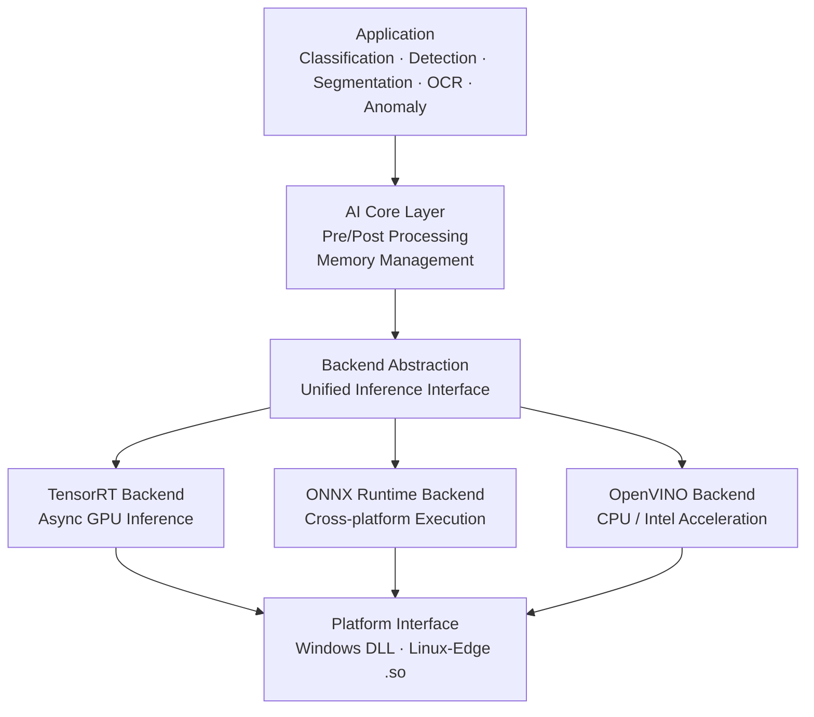

  

# 🐂 BISON AI Inference Engine

**BISON_AI Engine**은 다양한 컴퓨터 비전 모델을 최적의 성능으로 실행하기 위해 설계된 **고성능 크로스 플랫폼 C++ AI 추론 라이브러리**입니다. 

TensorRT, OpenVINO, ONNX Runtime 등 다중 백엔드를 단일 인터페이스로 통합하여, 하드웨어 환경(NVIDIA GPU, Intel CPU/GPU 등)에 맞춰 유연하게 모델을 배포하고 실시간 추론을 수행할 수 있습니다. 특히 산업용 비전 검사 장비(Windows DLL)와 엣지 디바이스(NVIDIA Jetson) 환경을 모두 완벽하게 지원합니다.

------------------------------------------------------------------------

## 🚀 Key Features

### 1. Multi-Backend Architecture
단일 API를 통해 시스템 사양에 최적화된 엔진을 선택적으로 사용할 수 있습니다.
* **NVIDIA TensorRT:** v8.6 및 v10.0 선택 가능, 최강의 GPU 추론 속도 제공.
* **Intel OpenVINO:** 인텔 CPU 및 내장 GPU 자동 감지 및 최적화 가속.
* **ONNX Runtime:** CPU 및 CUDA Execution Provider를 통한 범용적 추론 지원.

### 2. Comprehensive Vision Tasks
산업 현장에서 요구되는 다양한 최신 AI 모델 구조를 내장하고 있습니다.
* **Classification:** EfficientNet 시리즈 지원.
* **Object Detection:** YOLOv5 (NMS, Bounding Box 후처리 내장).
* **Segmentation:** YOLOv5-Seg (마스크 추출 및 **Contour(윤곽선)** 변환 최적화).
* **Anomaly Detection:** PyramidFlow 기반의 이상치 탐지.

### 3. Cross-Platform & Hardware Ready
* **Windows (DLL):** `lib.cpp`를 통한 C# 및 Windows 응용 프로그램용 인터페이스 제공. (예외 처리 및 Crash Dump 기능 포함)
* **Jetson (Linux):** `lib_Jetson.cpp`를 통해 ARM64 기반 리눅스 환경 및 전력 효율 최적화.

------------------------------------------------------------------------

## 📂 소프트웨어 아키텍처

------------------------------------------------------------------------

## 🛠 Tech Stack
| 분류 (Category) | 상세 기술 (Technology) |
| :--- | :--- |
| **Language** | C++ 20 (C-style Export API 지원) |
| **Computer Vision** | OpenCV 4.x |
| **Inference Backends** | TensorRT, OpenVINO, ONNX Runtime |
| **Acceleration** | CUDA, cuDNN, cuBLAS |
| **OS Support** | Windows 10/11, Ubuntu 20.04/22.04 (JetPack) |

------------------------------------------------------------------------
# Repository Scope

이 저장소는 Vision Framework 구조와 예제 컴포넌트를 제공합니다.

실제 상용 AI 모델 및 검사 알고리즘은 포함되어 있지 않습니다.

------------------------------------------------------------------------

# BISON AI Vision Lab

스마트 제조를 위한 산업용 AI 검사 기술
