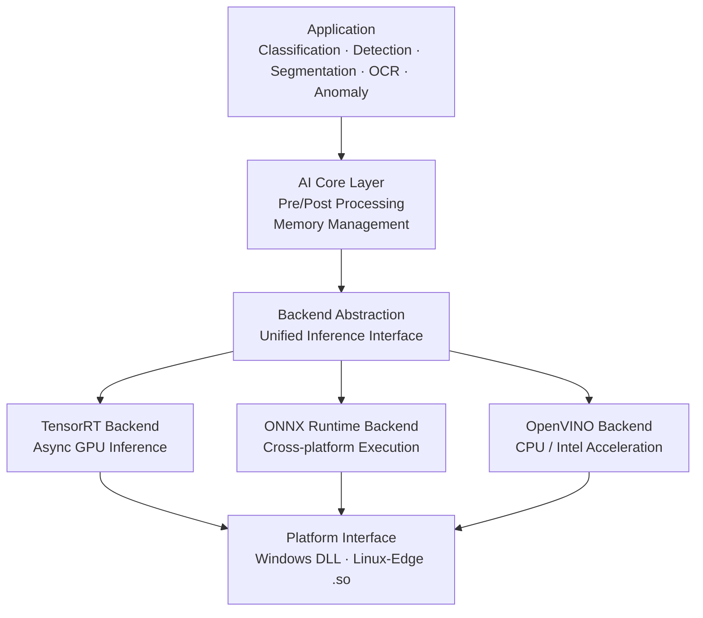

  

## BISON AI Inference Engine

산업용 머신비전 시스템을 위해 설계된 고성능 C++ 기반 AI 추론 엔진입니다.

BISON AI Engine은 다양한 컴퓨터 비전 모델을 최적의 성능으로 실행하기 위해 설계된 고성능 크로스 플랫폼 AI 추론 라이브러리입니다.

TensorRT, OpenVINO, ONNX Runtime 등 다중 백엔드를 단일 인터페이스로 통합하여, 하드웨어 환경(NVIDIA GPU, Intel CPU/GPU 등)에 맞춰 유연하게 모델을 배포하고 실시간 추론을 수행할 수 있습니다.  
특히 산업용 비전 검사 장비(Windows DLL)와 엣지 디바이스(Linux .so) 환경을 모두 완벽하게 지원합니다.
------------------------------------------------------------------------

## 주요 기능

### 1. 멀티 백엔드 아키텍처 (Multi-Backend Architecture)

단일 API를 통해 시스템 환경에 가장 적합한 추론 엔진을 선택하여 사용할 수 있습니다.

- **GPU 최적화 엔진**  
  NVIDIA GPU 환경에서 고속 추론을 위한 GPU 가속 백엔드 지원

- **Intel 가속 엔진**  
  Intel CPU 및 내장 GPU 환경에서 자동 최적화된 추론 실행

- **범용 런타임 엔진**  
  다양한 CPU/GPU 환경에서 동작 가능한 범용 추론 백엔드

---

### 2. 산업용 비전 작업 지원 (Comprehensive Vision Tasks)

산업 현장에서 요구되는 다양한 AI 비전 작업을 지원합니다.

- **이미지 분류 (Classification)**  
  제품 분류 및 상태 판별

- **객체 탐지 (Object Detection)**  
  불량 위치 탐지 및 객체 인식

- **영역 분할 (Segmentation)**  
  픽셀 단위 영역 분석 및 정밀 윤곽 추출

- **이상 탐지 (Anomaly Detection)**  
  정상 패턴 학습 기반의 이상 상태 탐지

---

### 3. 크로스 플랫폼 지원 (Cross-Platform & Hardware Ready)

다양한 운영 환경과 Edge AI 장치에서 안정적으로 동작하도록 설계되었습니다.

- **Windows (DLL 인터페이스)**  
  C#, .NET 기반 머신비전 시스템과 쉽게 통합 가능  
  예외 처리 및 Crash Dump 기능 포함

- **Linux / Edge (ARM64)**  
  Linux 기반 Edge AI 장치에서 전력 효율을 고려한 최적화된 추론 지원

------------------------------------------------------------------------

## 📂 소프트웨어 아키텍처

------------------------------------------------------------------------

## ⚙️ Core Technology

| Category | Description |
|---|---|
| **Language** | High-performance C++ inference engine |
| **Vision Processing** | Optimized computer vision processing pipeline |
| **Inference Engine** | Multi-backend AI inference architecture |
| **Hardware Acceleration** | GPU / CPU optimized inference |
| **Platform Support** | Windows, Linux, Edge AI devices |

------------------------------------------------------------------------
# Repository Scope

이 저장소는 AI Inference Engine 구조와 예제 컴포넌트를 제공합니다.

실제 상용 AI 모델 및 검사 알고리즘은 포함되어 있지 않습니다.

------------------------------------------------------------------------

# BISON AI Vision Lab

스마트 제조를 위한 산업용 AI 검사 기술
